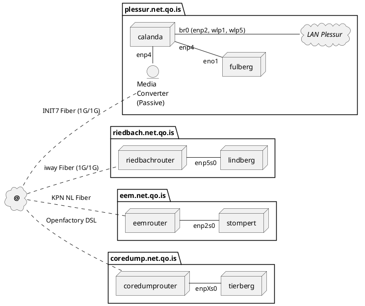

# Network

This document provides an overview over the qo.is network structure.

## Physical View

## DNS

All Services are published under the *qo.is* domain name. Following services are available:

`qo.is` Primery Domain - Redirect to docs.qo.is and some .well-known ressources

{{#include ../backplane-net/README.md}}

## Contacts

### Init7

- [Status Netzwerkdienste](https://www.init7.net/status/)
- [NOC E-Mail](mailto:noc@init7.net)
- +41 44 315 44 00
- Init7 (Schweiz) AG, Technoparkstrasse 5, CH-8406 Winterthur
