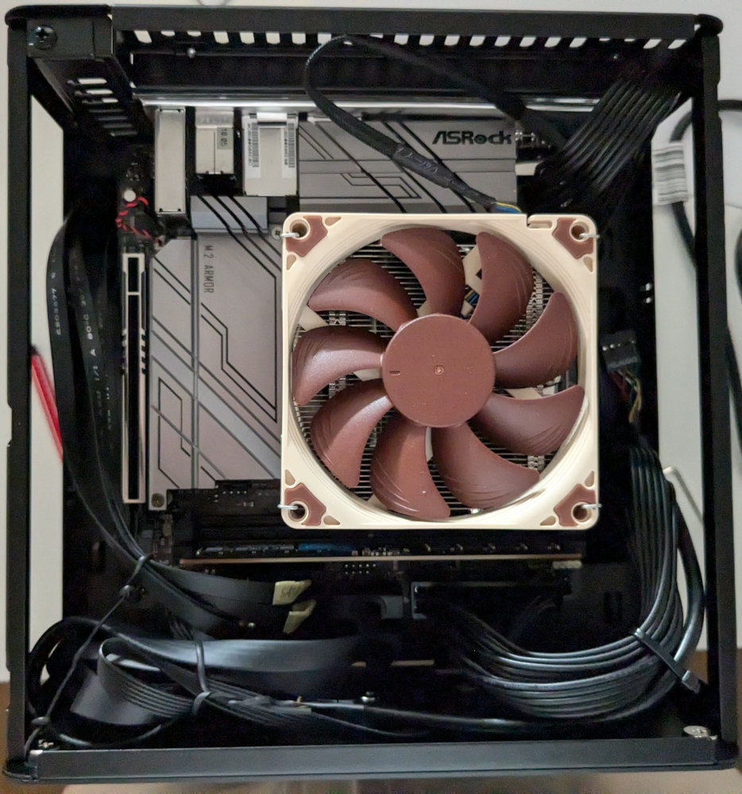
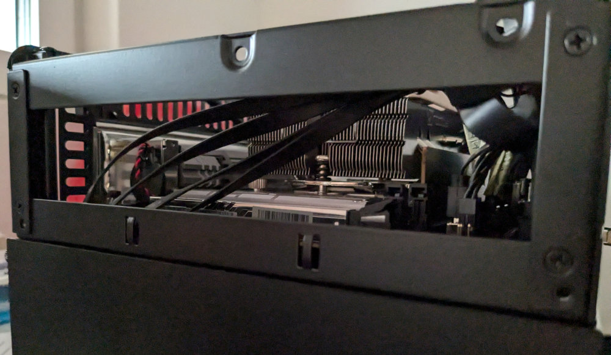

# Host: Cyprianspitz

## Operations {#_operations}

Reboot requires passphrase.

``` bash
# Get HDD Password:
sops decrypt --extract '["system"]["hdd"]' private/nixos-configurations/cyprianspitz/secrets.sops.yaml

ssh -p 8223 -J root@calanda.plessur-ext.net.qo.is
```

## Hardware

TODO

- [Mainboard Manual](docs/z790m-itx-wifi.pdf)


### Top Overview



### PCIE Side



### HDD Bay

Note that slot 5 (the leftmost) SATA bay is not connected due to the mainboard only having 4 SATA plugs.
