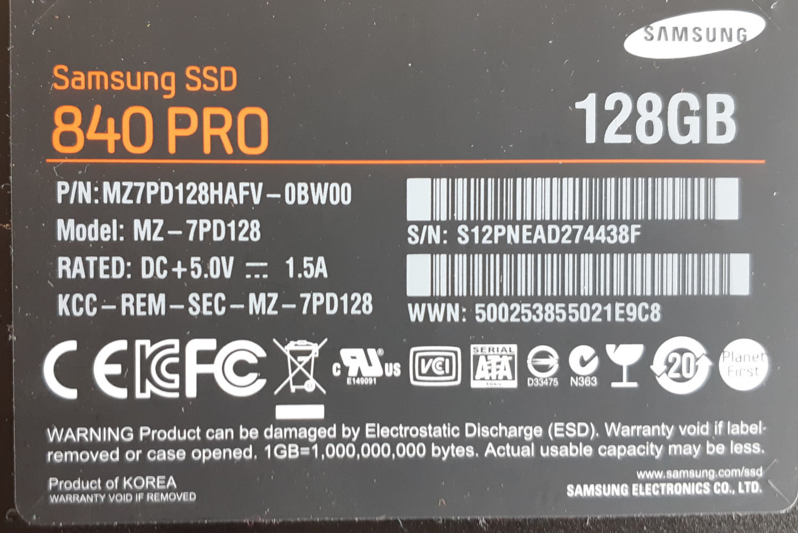

# Host: Lindberg

## Operations {#\_operations}

Reboot requires passphrase (see pass `host/lindberg/hdd_luks`)

```bash
ssh -p 2222 root@lindberg.riedbach-ext.net.qo.is
```

## Hardware

- [Mainboard Manual](docs/X570Pro4-mainboard-manual.pdf)

### Front / Back

#### Front Overview


#### Front PCIE


#### Front Cables


#### Back


### HDDs


#### HDD (0)


#### HDD (1)


#### HDD (3)


#### zvtaa02h


#### zvtaeypl


### SSD left


