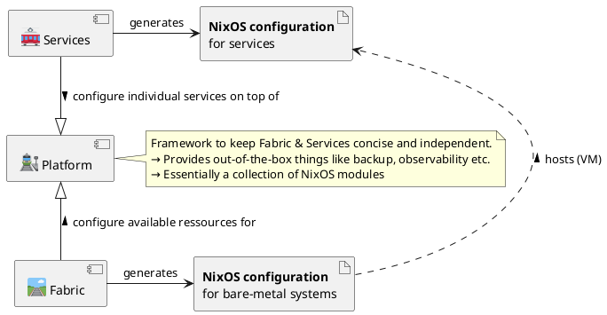

# MV Based Infrastructure

## Architecture

```plantuml
@startuml
together {
    component Services [
      <:train:> Services
    ]
    artifact ServiceConfig [
      <b>NixOS configuration</b>
      for services
    ]
    Services -right-> ServiceConfig: generates 
}


component Platform [
  <:station:> Platform
]

together {
    component Fabric [
      <:railway_track:> Fabric
    ]
    
    artifact HostConfig [
      <b>NixOS configuration</b>
      for bare-metal systems
    ]
    Fabric -right-> HostConfig: generates
}

Services -down-|> Platform: configure individual services on top of  > 

note right of Platform
  Framework to keep Fabric & Services concise and independent.
  → Provides out-of-the-box things like backup, observability etc.
  → Essentially a collection of NixOS modules
end note

Fabric -up-|> Platform: configure available ressources for > 

HostConfig ...[norank]...> ServiceConfig: hosts (VM) > 
@enduml
```
